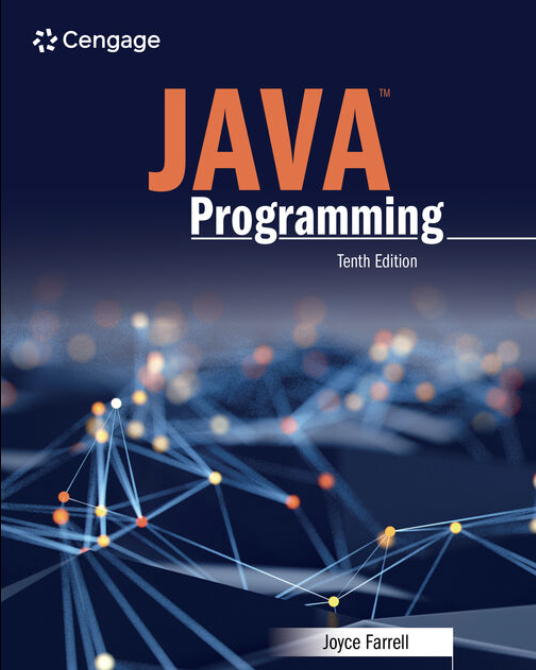
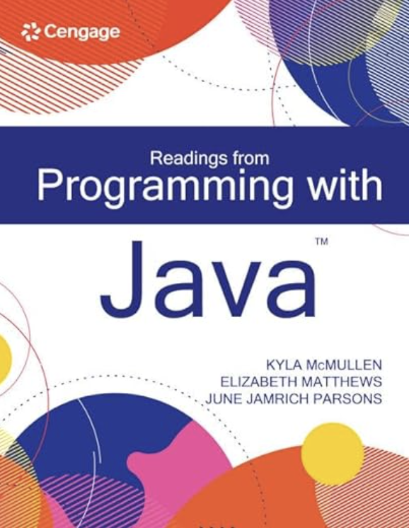
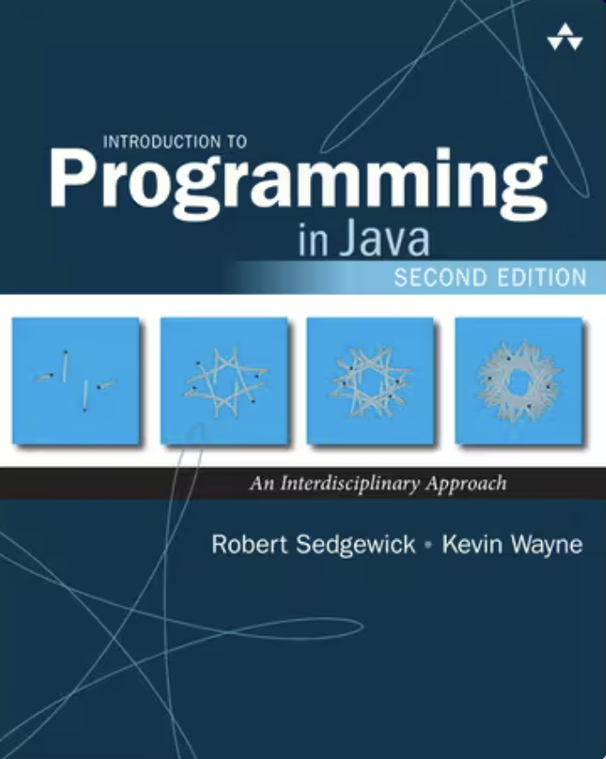

# IT101-2
Computer Programming Concepts 2

### Course Materials

* 
* 
* 
* [HackerRank - Java Challenges](https://www.hackerrank.com/challenges/welcome-to-java)
* [W3Schools](https://www.w3schools.com/java/)

### Course Schedule

|Week|Module|Dates|Topic|
|-|-|-|-|
|1|M1|31-Mar to 5-Apr|Computational Thinking, Programming Tools, Literals, Variables, Constants, and Data Types (Numeric, Character, String)|
|2|M1|7-Apr to 12-Apr| Decision and Repetition Control Structures, Functions and Methods, and Recursion|
|3|M1|14-Apr to 19-Apr| Arrays|
|4|M1|21-Apr to 26-Apr| File Handling|
|5|M1|28-Apr to 3-May| Regular Expressions and Essential Java Classes|
|6|M1|5-May to 10-May| Topic Review|
|7|M1|12-May to 17-May| Summative Assessment|
|8-12|M2| |GUI|
|13|M2| | Summative Assessment|
|14|M2| | Grade Completion and Submission|

### References

* [Java Cheatsheet by Princeton U.](https://introcs.cs.princeton.edu/java/11cheatsheet/)
